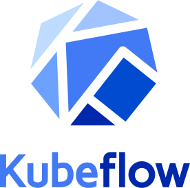

# Adetoyeshe Arigbabuwo
### *Software & Machine Learning Engineer*
*Founder at Motherland AI* 

[</img>](https://github.com/princegbabuwo)
&nbsp;&nbsp;&nbsp;&nbsp;

&nbsp;&nbsp;&nbsp;&nbsp;

&nbsp;&nbsp;&nbsp;&nbsp;

 

*Founder at Motherland AI* . Driving AI innovation in Africa through cutting-edge language processing models. I am focused on developing crucial African Language Processing Models to accelerate AI adoption across the continent. my mission is: to bridge the technological gap and empower African businesses and communities with tailored AI solutions.

## Courses Certifications
* [Introduction to Machine Learning (1)](https://drive.google.com/file/d/1mmU3nTjaUeYOo2odR4GfeB1OGh8EPhbe/view?usp=drive_link)

* [Introduction to Machine Learning (2)](https://www.kaggle.com/learn/certification/adetoyeshearigbabuwo/intro-to-machine-learning)

* [Data Cleaning](https://www.kaggle.com/learn/certification/adetoyeshearigbabuwo/data-cleaning)

* [Data Visualization](https://www.kaggle.com/learn/certification/adetoyeshearigbabuwo/data-visualization)

* [Feature Engineering](https://www.kaggle.com/learn/certification/adetoyeshearigbabuwo/feature-engineering)

* [Artificial Intelligence and Machine Learning Fundamentals](https://www.udemy.com/certificate/UC-41d45651-33b3-4569-8cc3-c38b0f5bfc89/)

* [Introduction to Deep Learning](https://www.kaggle.com/learn/certification/adetoyeshearigbabuwo/intro-to-deep-learning)

* [Neural Networks and Deep Learning](https://www.coursera.org/account/accomplishments/records/CWXK45GT9C9J)

* [Computer Vision](https://www.kaggle.com/learn/certification/adetoyeshearigbabuwo/computer-vision)

* [Foundations of Prompt Engineering](https://drive.google.com/file/d/1tbD056rcv_A87qx6-QxAnX9-WBicZSCZ/view?usp=drive_link)

* [AWS Amazon Bedrock](https://drive.google.com/file/d/10etOp-Gkg061r1fIH-zFp2yKw5mQ7wXY/view?usp=drive_link)

* [Introduction to Amazon SageMaker](https://drive.google.com/file/d/19fKGG3vuc3QzLqD5jZTH9-XbjNBMJQsv/view?usp=drive_link)

* [Building Language Models on AWS](https://drive.google.com/file/d/18AvJ4IsSW0viSZPOksXZYoDK7JPQTjXA/view?usp=drive_link)

* [Time Series](https://www.kaggle.com/learn/certification/adetoyeshearigbabuwo/time-series)

* [Introduction to Game AI and Reinforcement Learning](https://www.kaggle.com/learn/certification/adetoyeshearigbabuwo/intro-to-game-ai-and-reinforcement-learning)

* [Geospatial Analysis](https://www.kaggle.com/learn/certification/adetoyeshearigbabuwo/geospatial-analysis)

* [Advanced SQL](https://www.kaggle.com/learn/certification/adetoyeshearigbabuwo/advanced-sql)

* [Introduction to AI Ethics](https://www.kaggle.com/learn/certification/adetoyeshearigbabuwo/intro-to-ai-ethics)

* [Machine Learning Explainability](https://www.kaggle.com/learn/certification/adetoyeshearigbabuwo/machine-learning-explainability)

* [Nature of intelligence](https://www.udemy.com/certificate/UC-1f5b8821-780d-4a5e-9d20-501c66538af3/)

# Technology Stacks & Tools
## Operating Systems:
</img>
&nbsp;&nbsp;&nbsp;&nbsp;
</img>
&nbsp;&nbsp;&nbsp;&nbsp;
</img>
&nbsp;&nbsp;&nbsp;&nbsp;
 

## Computer Languages:
</img>
&nbsp;&nbsp;&nbsp;&nbsp;

&nbsp;&nbsp;&nbsp;&nbsp;

&nbsp;&nbsp;&nbsp;&nbsp;

 

## Libraries & Frameworks
</img>
&nbsp;&nbsp;&nbsp;&nbsp;
</img>
&nbsp;&nbsp;&nbsp;&nbsp;

&nbsp;&nbsp;&nbsp;&nbsp;

&nbsp;&nbsp;&nbsp;&nbsp;

&nbsp;&nbsp;&nbsp;&nbsp;

&nbsp;&nbsp;&nbsp;&nbsp;

&nbsp;&nbsp;&nbsp;&nbsp;

&nbsp;&nbsp;&nbsp;&nbsp;

&nbsp;&nbsp;&nbsp;&nbsp;

 

## Database Engines:
</img>
&nbsp;&nbsp;&nbsp;&nbsp;

&nbsp;&nbsp;&nbsp;&nbsp;

&nbsp;&nbsp;&nbsp;&nbsp;
</img>
&nbsp;&nbsp;&nbsp;&nbsp;

&nbsp;&nbsp;&nbsp;&nbsp;

&nbsp;&nbsp;&nbsp;&nbsp;

&nbsp;&nbsp;&nbsp;&nbsp;
 

## Cloud & Deployment Platforms:

&nbsp;&nbsp;

&nbsp;&nbsp;&nbsp;&nbsp;

&nbsp;&nbsp;&nbsp;&nbsp;

&nbsp;&nbsp;&nbsp;&nbsp;

&nbsp;&nbsp;&nbsp;&nbsp;

&nbsp;&nbsp;&nbsp;&nbsp;
 

## ML Experiment Tracking
</img>
&nbsp;&nbsp;&nbsp;&nbsp;

&nbsp;&nbsp;&nbsp;&nbsp;

## Other ML Tools
</img>
&nbsp;&nbsp;&nbsp;&nbsp;

&nbsp;&nbsp;&nbsp;&nbsp;

&nbsp;&nbsp;&nbsp;&nbsp;

&nbsp;&nbsp;&nbsp;&nbsp;

<!--

# Technology Stacks & Tools
## Operating Systems:
- Windows
- Linux
- MacOS

## Computer Languages:
- Python
- C++
- R
- Rust

## Libraries & Frameworks
- Tensor Flow
- Keras
- PyTorch
- Numpy 
- Scikit Learn
- Pandas
- Spacy
- HuggingFace Transformers
- OpenCV
- Pillow
- Apache Hadoo
- NLTK
- Apache MXNet
- Microsoft COgnitive Toolkit

## Database Engines:
-PostgreSQL
- MySQL
- SQLite
- MongoDB
- Canssandra DB
- Redis

## Cloud & Deployment Platforms:
- AWS
- Google Cloud
- Microsoft Azure
- Docker
- Kubernetes
- KubeFlow

## ML Experiment Tracking
- ML Flow
- Weights and Biases
- Neptune.ai

## Other ML Tools
- Data Robot
- Git
- GitHub
- GitLab
- Apache Kafka
- Apache Spark
- JupyterLab and Jupyter Notebook
- Google Collab
- Label Studio
- Amazon SageMaker
- Google BugQuery
-->
